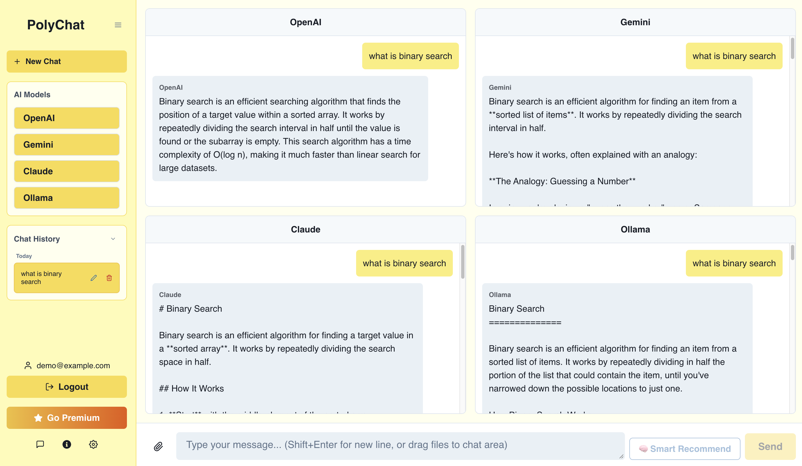
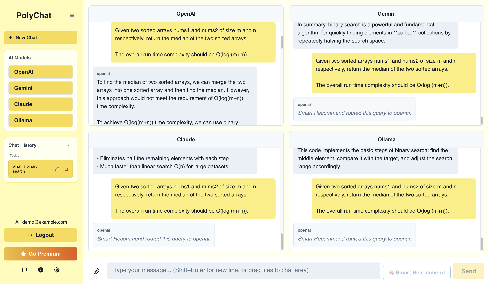
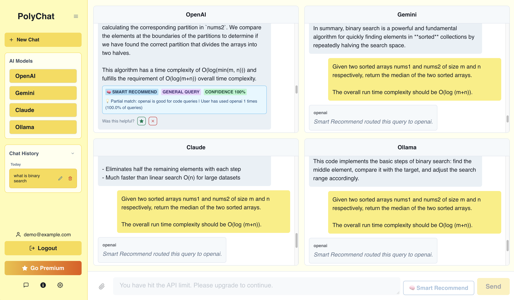

# PolyChat: Multi-Armed Bandit LLM Router

An intelligent multi-LLM chat platform that dynamically routes user queries to the most suitable AI model (GPT-4, Claude, Gemini, Ollama) using Thompson Sampling, with real-time feedback learning.

### Four AI models responding simultaneously


### Smart Recommend routing query to optimal LLM


### Recommendation Badge with confidence score and feedback


---

## How It Works

```
User Query
    ↓
NLP Feature Extraction (TF-IDF + Sentence Transformers)
    ↓
Query Classification (code / analytical / creative / simple / technical)
    ↓
Thompson Sampling Bandit selects optimal LLM
    ↓
Real AI response returned
    ↓
User feedback (👍/👎) updates Beta distribution
    ↓
Model improves for next query
```

**Cold Start:** Domain-specific priors initialize the Bandit before any user data exists, enabling intelligent routing from the first query.

**Online Learning:** Each 👍/👎 updates the Beta distribution parameters (alpha/beta) in real-time, continuously shifting routing preference toward higher-performing models per user.

---

## Key Features

- **🧠 Smart Recommend** — Recommends the best AI for each query based on query type and user history
- **📊 Confidence Score** — Shows routing confidence percentage for each recommendation
- **💡 Recommendation Reason** — Explains why a specific AI was chosen
- **👍/👎 Feedback** — Real-time model updates from user feedback
- **4 AI Providers** — OpenAI, Claude, Gemini, Ollama (local)
- **Side-by-side comparison** — See all AI responses simultaneously

---

## Benchmark Results

| Metric | Value |
|--------|-------|
| Avg recommendation latency | **76ms** (p95: 118ms) |
| Routing confidence at convergence | **77%** |
| Query categories supported | **5** (code, analytical, creative, simple, technical) |
| Providers evaluated | **4** |

---

## Tech Stack

**ML / Recommendation System**
- Python, FastAPI, Uvicorn
- Thompson Sampling (Beta Distribution)
- Sentence-Transformers (`all-MiniLM-L6-v2`)
- Scikit-learn (TF-IDF)
- NumPy, SQLite

**Backend**
- Node.js, Express
- MongoDB (Atlas)
- OpenAI API, Anthropic API, Google Gemini API, Ollama

**Frontend**
- React 19, Chakra UI
- Axios, React Router

---

## Getting Started

### Prerequisites

- Node.js 16+
- Python 3.11+ (conda environment recommended)
- MongoDB Atlas account
- API keys: OpenAI, Anthropic (Claude), Google Gemini

### Installation

**1. Clone the repository**
```bash
git clone https://github.com/doloresjdd/PolyChat.git
cd PolyChat
```

**2. Set up environment variables**
```bash
# backend/.env
OPENAI_API_KEY=your_openai_key
CLAUDE_API_KEY=your_claude_key
GEMINI_API_KEY=your_gemini_key
OLLAMA_API_URL=http://localhost:11434
MONGO_URI=your_mongodb_connection_string
```

**3. Install dependencies**
```bash
# Node backend
cd backend
npm install

# Frontend
cd ../frontend
npm install
```

**4. Set up Python environment**
```bash
conda create -n polychat python=3.11
conda activate polychat
cd backend
pip install -r requirements.txt
```

### Running the App

You need 4 terminals:

```bash
# Terminal 1 — Node backend (port 8000)
cd backend
node server.js

# Terminal 2 — Python ML backend (port 8001)
cd backend
conda activate polychat
uvicorn main:app --reload --port 8001

# Terminal 3 — Ollama (optional, for local model)
ollama serve

# Terminal 4 — Frontend (port 3000)
cd frontend
npm start
```

Open [http://localhost:3000](http://localhost:3000)

Login: any email / `wordpass`

---

## Project Structure

```
PolyChat/
├── backend/
│   ├── server.js              # Node.js API server
│   ├── main.py                # FastAPI ML server
│   ├── ml/
│   │   ├── bandit.py          # Thompson Sampling Bandit
│   │   ├── recommender.py     # AI recommendation logic
│   │   └── feature_extractor.py  # NLP feature extraction
│   ├── api/
│   │   ├── routes/
│   │   │   ├── recommend.py   # Recommendation endpoint
│   │   │   └── feedback.py    # Feedback collection endpoint
│   │   └── shared.py          # Singleton instances
│   ├── data/
│   │   ├── database.py        # SQLite interactions & feedback
│   │   └── collector.py       # Data collection
│   └── benchmark.py           # Performance benchmarking
└── frontend/
    └── src/
        ├── App.js             # Main React app
        └── contexts/
            └── SettingsContext.js
```

---

## How Smart Recommend Works

1. **Query Classification** — NLP pipeline classifies the query into one of 5 categories using TF-IDF and Sentence Transformer embeddings

2. **Thompson Sampling** — For each provider, samples from its Beta distribution `Beta(alpha, beta)`. Provider with highest sample wins

3. **Cold Start** — When a provider has fewer than 5 observations, domain-specific priors are used instead of learned parameters

4. **Feedback Loop** — 👍 increases `alpha`, 👎 increases `beta`. Expected reward = `alpha / (alpha + beta)`

5. **Exploration** — Thompson Sampling naturally explores all providers occasionally, collecting comparative data without explicit A/B testing

---

## License

MIT License
# test
